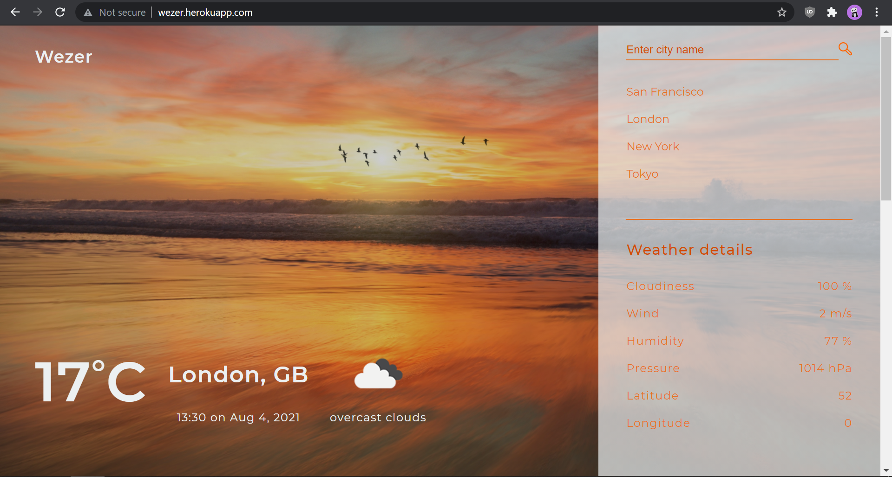
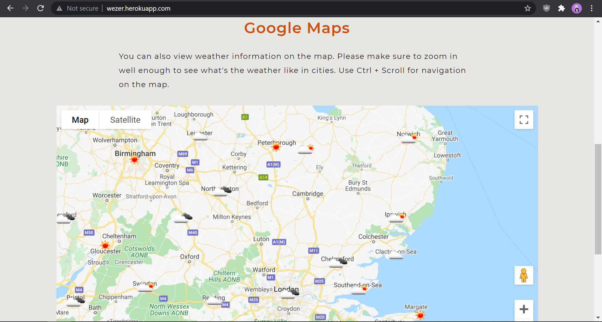

# **Wezer**

The webapp shows what's the weather like in cities around the world. It show weather details both in numeric form and on a map.

## Screenshots

&nbsp;

## Getting started

To get the Node server running locally:

- Clone this repo
- `npm install` to install all required dependencies
- `node app.js` to start the local server

## Code Overview

### Dependencies

- [expressjs](https://github.com/expressjs/express) - The server for handling and routing HTTP requests
- [dotenv](https://github.com/motdotla/dotenv) - Zero-dependency module that loads `.env` file into `process.env`

### Application Structure

- `app.js` - The entry point to the application. This file defines our express server and connects it to express. It also requires the routes and models used in the application.
- `public/` - This folder contains all the client-side files

### Built with

- The webapp uses [OpenWeatherMap API](https://openweathermap.org/api) to fetch weather data about cities and [Google Maps Javascript API](https://developers.google.com/maps/documentation/javascript/overview) to display the map.

### Links
[https://wezer.herokuapp.com/](https://wezer.herokuapp.com/)